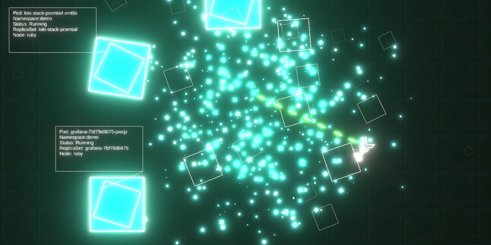

# kube-chaos

Kube Chaos is a twin-stick style shmup game in the style of chaos engineering.

The game interfaces with your Kubernetes cluster and allows you to explore your cluster nodes and destroy live, running pods on those nodes.

The game logic is written in C# and is powered by the Unity engine.

## Requirements

* kubectl and a working kube context to your cluster. Kubectl must be in your system path too.
* A namespace with running pods (that you don't mind destroying via the game)
* Decent enough hardware to run the game. (It uses Unity engine)

## Downloading and Running

### Source

You can compile the source and build your own executable yourself. You'll need [Unity](https://unity3d.com/get-unity/download) version 2019.4 or later. When doing this you should be able to switch and build for multiple platforms. Linux and macOS builds should work fine in addition to Windows.

### Release

You can download a pre-compiled release from the [Releases](https://github.com/Shogan/kube-chaos/releases) page. Unzip and run the executable to get started.

## Configuration

The starting screen will allow you to enter your:

* **Kube context name**. Default `kubernetes-admin@kubernetes`.
* **Namespace** to target (find and destroy pods). Default `demo`.
* Name of your **kubectl** executable/binary. Default `kubectl`

## Other

The game is really just a POC, and I hacked it together pretty quickly. In an ideal world I would have got the C# kubernetes-client library working with Unity and used the kube API. NuGet and Unity don't play nicely together so for a quick hack solution I went with calling out to the kubectl process from in-game. These processes are launched in separate threads to keep the game smooth and pause-free. I don't do any fancy thread lifecycle management, so threads are aborted/killed randomly during the game. Performance still seems fine for the demo.

There may be small issues here and there. Feel free to raise them as issues and/or fix them and submit PRs.