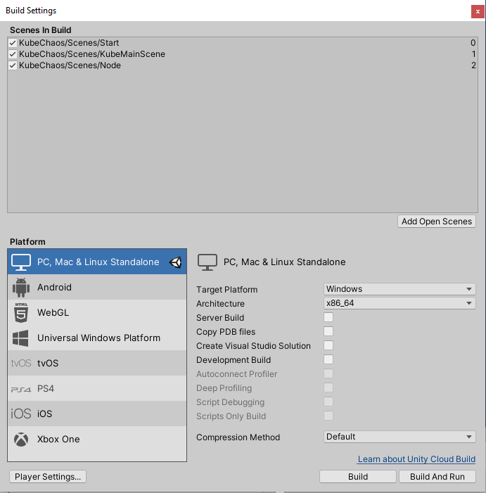
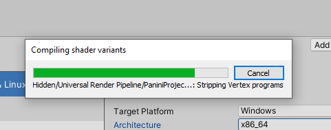
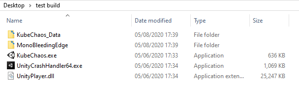

# kube-chaos

Kube Chaos is a twin-stick style shmup game in the style of chaos engineering. The game interfaces with your Kubernetes cluster and allows you to explore your cluster nodes and destroy live, running pods on those nodes. The game logic is written in C# and is powered by the Unity engine.

https://user-images.githubusercontent.com/814180/119267327-07a41c80-bbe6-11eb-87ec-25ee0f96e669.mp4

[Read more about kube-chaos' beginnings here](https://www.shogan.co.uk/kubernetes/i-made-a-kubernetes-game-where-you-explore-your-cluster-and-destroy-pods/)

## Requirements

* kubectl and a working kube context to your cluster. Kubectl must be in your system path too.
* A namespace with running pods (that you don't mind destroying via the game)
* Decent enough hardware to run the game. (It uses Unity engine)

## Downloading and Running

### Source

You can compile the source and build your own executable yourself. You'll need [Unity](https://unity3d.com/get-unity/download) version 2019.4 or later. When doing this you should be able to switch and build for multiple platforms. Linux and macOS builds should work fine in addition to Windows.

### Release

You can download a pre-compiled release (Windows/macOS) from the [Releases](https://github.com/Shogan/kube-chaos/releases) page. Unzip and run the executable to get started.

## Building

To build from source, install Unity 2019.4 or later. The default installation will allow you to target PC, macOS or Linux Standalone.

* Launch the Unity Editor or Unity Hub and load the project from the root folder level of this repository.
* On first load, Unity will generate the library assets. Be patient as this can take a few minutes sometimes.
* Go to **File -> Build Settings** (or CTRL/CMD-SHIFT-B). Make sure the settings and Scenes In Build look like the below:

* Configure the **Target Platform** to the platform you want to build for. E.g. Windows / macOs / Linux.
* Optionally configure Window resolution and other settings using the **Player Settings** button. The defaults should be fine though.
* Click **Build** and choose a location for the output build. Once complete the executable to launch the game will be placed in this location.
* The build will take a few moments to complete...

* Open the executable to run the game.

## Game Configuration

The starting screen will allow you to enter your:

* **Kube context name**. Default `kubernetes-admin@kubernetes`.
* **Namespace** to target (find and destroy pods). Default `demo`.
* Name of your **kubectl** executable/binary. Default `kubectl`

**Note for macOS**: Enter the full / absolute path to kubectl in the textbox in the main menu. Click Start. If your nodes don't appear in the spawn area, then quit the game (CMD + Q) and try again. There seems to be a time related bug around the game executing the kubectl process in the background on initial start (where `KubeManager.cs` should load the node info to begin with in a thread).

## Other

The game is really just a POC, and I hacked it together pretty quickly. In an ideal world I would have got the C# kubernetes-client library working with Unity and used the kube API. NuGet and Unity don't play nicely together so for a quick hack solution I went with calling out to the kubectl process from in-game. These processes are launched in separate threads to keep the game smooth and pause-free. I don't do any fancy thread lifecycle management, so threads are aborted/killed randomly during the game. Performance still seems fine for the demo.

There may be small issues here and there. Feel free to raise them as issues and/or fix them and submit PRs.
